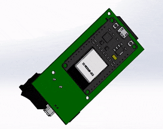
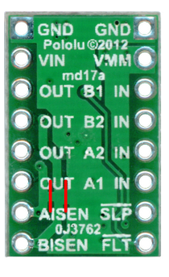
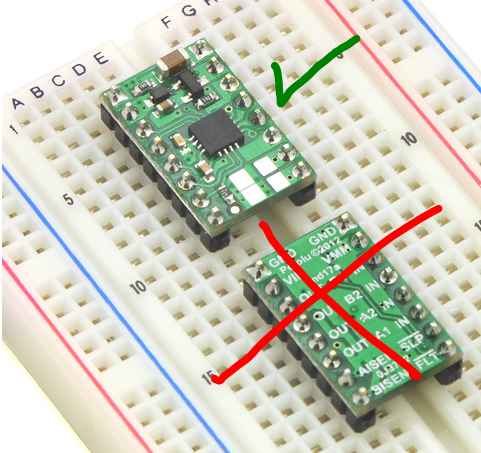
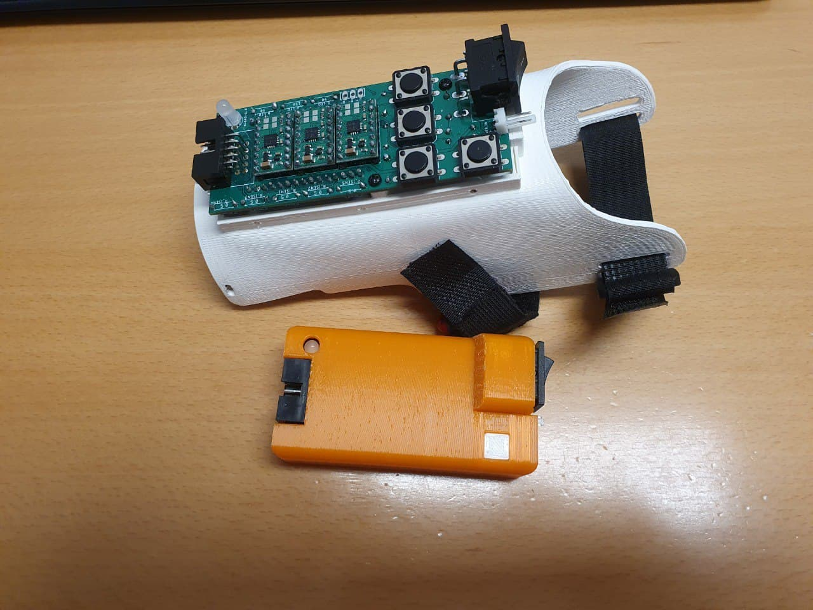
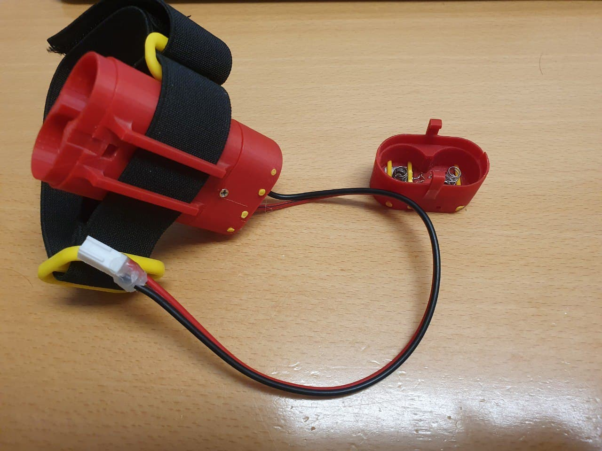

# Oded Hand Electrical Design  

This project is a sub-project of Haifa3D Robotic Hand.
In this project, we present the electrical design of the Oded Hand – a 3D printed robotic hand with five micro-DC motors. 
The aim of this design is to be low cost, accessible, easy to assemble, robust and lightweight.  

     

## Design Description  
The Oded Hand can perform a variety of user-defined hand configurations using an autonomous adaptive grip along with a variety of configurable grip force levels.
The electrical design consists of four fingers with four different tendon-driven mechanisms actuated by four micro-DC motors, a passive thumb which magnetically locks in two discrete positions and wrist rotation driven by planetary gears and a DC motor. 

The electronic system consists of:
* The circuit and controller code
* The circuit housing and socket
* The batteries housing

The electronic system presented here also allows a Bluetooth communication between the Hand and your phone for settings configuration and a modular sensors control (see our [Mobile App](https://github.com/Haifa3D/haifa3d-hand-app)). For more details on how to manufacture and assemble the hand, please check out our [Mechanical Design](https://github.com/Haifa3D/hand-mechanical-design). 

## Who can benefit from this Design?  
The design is suitable for users with transradial amputation (below the elbow).
We welcome any new developers to enhance our design or to use the Oded Hand as a simulator for your new sensors/algorithms/methods that would potentially help users with controling their prosthetic hand.

## Design Files and Versions  
The STL files for the battery housing and the circuit housing can be found [here](CAD_files). The gerber files of the PCB design can be found [here](gerber_files/CAMOutputs) as well as the [schematic and layout](docs). The EAGLE files for modifying the board can be found [here](EAGLE_files). The Arduino code for the controller can be downloaded from [here](controller_software/Oded_Hand_board7_app2_4_6).

## Getting Started:
To build the electronic system for Oded Hand you will need a basic knowledge of soldering and the following componenets: 

| Component Name | Quantity | Value | links |
| --- | --- | --- | --- |
| ESP32 DEVKIT V1| 1 | - | [pinouts](https://randomnerdtutorials.com/esp32-pinout-reference-gpios/) [aliexpress](https://www.aliexpress.com/item/4000071762309.html?spm=a2g0s.9042311.0.0.64074c4du1Hh8a) |
| DRV8833 Pololu breakout board | 3 | - | [pololu](https://www.pololu.com/product/2130) | 
| micro metal dc motor | 5 | MP/LP, 100-200 RPM x 4, 30RPM x 1 | [pololu](https://www.pololu.com/product/2360), [aliexpress](https://www.aliexpress.com/item/32780995439.html?spm=a2g0s.9042311.0.0.27424c4dhW29h7) | 
| IDC Connector flat cable | 1 x Right Angle Male + 1 x Female | 5x2 pins | [aliexpress RA Male](https://www.aliexpress.com/item/32841491672.html?spm=a2g0s.9042311.0.0.64074c4du1Hh8a), [aliexpress Female](https://www.aliexpress.com/item/32848157974.html?spm=a2g0s.9042311.0.0.64074c4du1Hh8a) |
| KF2510 Connector | 1 x Right Angle Male + 1 x Female  | 2 pins, 2.54mm pitch | [aliexpress](https://www.aliexpress.com/item/4000229650832.html?spm=a2g0o.productlist.0.0.580e59f7kz5W45&algo_pvid=70b8595e-d2a1-41e6-90ef-ca210f686aeb&algo_expid=70b8595e-d2a1-41e6-90ef-ca210f686aeb-20&btsid=2100bb4c16102253905804689e5410&ws_ab_test=searchweb0_0,searchweb201602_,searchweb201603_) |
| Right Angle SPDT Rocker Switch | 1 | for 3 Amp | [aliexpress](https://www.aliexpress.com/item/32949165803.html?spm=a2g0s.9042311.0.0.27424c4dTdJU1d) |
| RGB LED Common Cathode | 1 | Common Cathode | [aliexpress](https://www.aliexpress.com/item/32666259962.html?spm=a2g0s.9042311.0.0.27424c4dhW29h7) |
| Li-ion 18650 battery | 2-4 | >2500mAh | [aliexpress](https://www.aliexpress.com/item/32928155604.html?spm=a2g0s.9042311.0.0.27424c4dhW29h7) |
| battery Spring Contact Plate For AA AAA Battery | 4 | =< 12x12 mm |[aliexpress](https://www.aliexpress.com/item/1005001308633882.html?spm=a2g0o.detail.1000014.4.231d5d481DZZjH&gps-id=pcDetailBottomMoreOtherSeller&scm=1007.33416.205061.0&scm_id=1007.33416.205061.0&scm-url=1007.33416.205061.0&pvid=e82892c5-870e-4ffe-bb26-f0607f6946e2&_t=gps-id:pcDetailBottomMoreOtherSeller,scm-url:1007.33416.205061.0,pvid:e82892c5-870e-4ffe-bb26-f0607f6946e2,tpp_buckets:668%230%23131923%2347_668%23888%233325%235_23416%230%23205061%2320_23416%234721%2321967%23165_23416%234722%2321972%2310_668%232846%238112%231997_668%232717%237562%23468_668%231000022185%231000066059%230_668%233422%2315392%23668_4452%230%23211409%230_4452%233474%2315675%2389_4452%234862%2322449%23497_4452%233098%239599%23887_4452%235108%2323442%23113_4452%233564%2316062%236) |
| Resistors (through hole) |  | 1x2M, 1x1M, 1x10K, 2x100ohm, 1x150ohm, 5x(0.5-0.7)ohm | |

### Instructions
* send the [gerber files](gerber_files/CAMOutputs) for manufacturing at one of the availble online services (for instance, check out [PCBWay](https://www.pcbway.com/))

* order all the components from the list above.

* Cut the drv8833 according to [Pololu's instructions](https://www.pololu.com/product/2130) and check that both of the Isense pins are NOT grounded:
 
[image was taken from Pololu website]

*Tip: cut with a sharp knife the two lines, check with multimeter the resistence between AISEN/BISEN and GND. should be ~100Mohms*

* solder the headers of the drv8833 so the chip faces upward:
 
[image was taken from Pololu website]

* Solder the top side of the board (all components except the ESP32 and resistors)

*Tip: start from the led(the smallest pitch) --> drivers (drv8833)-->connectors --> button --> Switch

* Check all connections with a multimeter, to make sure everything was soldered correctly. Then cut all the pins so when you insert the esp32 controller to the bottom part nothing touches the controller. 

* Upload the [arduino code](controller_software/Oded_Hand_board7_app2_4_6) to the esp32 or an empty code, and only then solder the esp32 and the resistors (making sure there is no previous code that might cause problem to the component when it turned on). For the resistors: 1M and 2M for the voltage divider, 10K for the button, 2x100 and 1x150 ohm for the LEDs, 5x0.5ohm for the Rsense (you can use also 0.7 ohm)

If it is the first time you are using the controller - download our [Mobile App](https://play.google.com/store/apps/details?id=com.gjung.haifa3d), connect to the hand, go to configuration and click on rest all configuration parameters and preset parameters before any other action.

After you complete the PCB assembly of Oded's Hand, please refer to the [Mechanical Design](https://github.com/Haifa3D/hand-mechanical-design) to assemble the mechanical parts of Oded's Hand. If you have already assembled the mechanical and the electrical parts, you are welcome to check out our [Mobile App](https://github.com/Haifa3D/haifa3d-hand-app) to refine the controller parameters and to define your favorite hand movements.

## The Controller Software (Arduino code):
The code can be found [here](controller_software/Oded_Hand_board7_app2_4_6)

## The Circuit Housing and Socket
[Here](hand-electronic-design/CAD_files/circuit_housing), you can find the CAD of the circuit itself, the housing of the circuit top and bottom parts and the socket design we are using.
The socket is basically a flat surface which can be thermoformed and adjusted to fit the user arm. Usually the important measurements are the perimeter and length of the user's arm.

*Recommendation, merge the bottom part of the circuit housing into your socket design and print it as one part. If your socket design is based on thermoforming, heat the inner part of the socket so the bottom part of the circuit housing will not get deformed*.

To assemble the circuit housing you will need **3 x M2.5 5-8mm self tap screws** to mount the PCB to the bottom part and **2 x M2 5-6mm self tap screws** to connect the top to the bottom. To connect the hand to the socket you can use **3 x M2.5 5-8mm self tap screws** as well.

*The pictured circuit on the socket is from a previous version where we had 3 buttons on the hand instead of the mobile app for control.*

## The Batteries Housing
You can use any two connected batteries in series to power the circuit. 
To assemble your own battery pack:
* print the [batteries housing files](CAD_files/batteries_housing) (*Notice the printing orientation - the 'battery_top' should be printed so its snap is parallel to the ground*)
* make sure the batteries can slide in smoothly without getting stuck at the housing walls.
* Solder the battery Spring Contact Plate - at the 'battery-top' (the lid) the plates should be soldered to each other and at the bottom each plate should be soldered to a different wire (the maximal total current can be 2.5 amp so make sure you select a suitible wire)
* Insert the filaments to mount the contact plates to the rectangular slots at the top and bottom parts. Make sure the plates are not touching each other at the bottom part (otherwise you are going to short the batteries).
* cut the excess filaments and heat the ends (see the yellow fillaments in the image below)
* screw the bottom part to the body using two **M2 4-5mm self tap screws**
* check the connection and add a 2PIN Female KF2510 Connector to the wires.
* cut an elastic strap and sew velcro (or just buy a suitible velcro elatic strap) to fasten the Battery Pack to your upper arm. a design for backles and rings are also available at the same folder.

## So What To Do Next?
If you have developed a user interface for prosthetic hands and want to implement it on a low-cost prosthetic hand, you can communicate with our Hand in three different ways:
* if your sensors and system are on the hand and arm - you can implement your code to our controller code and solder your system to the free pins (GPIO2,12,25)
* if your system is android-based - use our [**mobile app and SDK**](https://github.com/Haifa3D/haifa3d-hand-app) to wirelessly communicate with our Hand 
* if your system is esp32-based - use the example Arduino IDE code [here](controller_software/Hand_UI_demo_BLEclient) to communicate with our Hand using the built-in BLE of the esp32 controller.
* if your system is based on Python code - use the [communication example Python code](python_communication_code/) to trigger different hand movements

## Acknowledgements:
This project was done by a group of great people and with the help and guidance of generous organizations.

*Electrical design*:  Shunit Polinsky, Yair Herbest, and Noah Bernten.

*Users Communication*: Haifa 3D – a nonprofit organization that designs and builds hands for free, founded by Yoav Medan and Yacov Malinovich.

*Resources*: The Technion - Israel Institute of Technology and special thanks to Prof. Alon Wolf and the Biorobotics and Biomechanics Lab.

## Donation:

